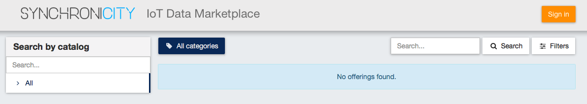
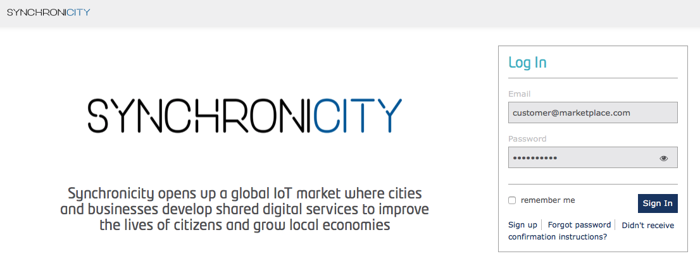
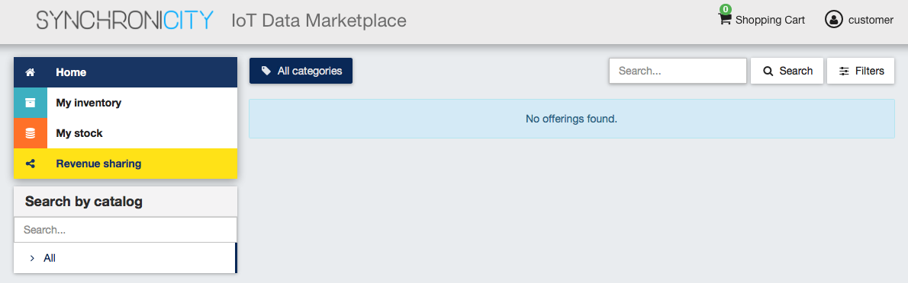
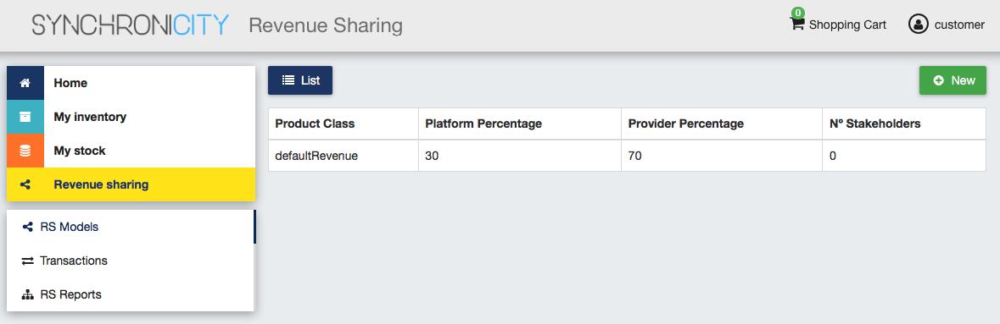
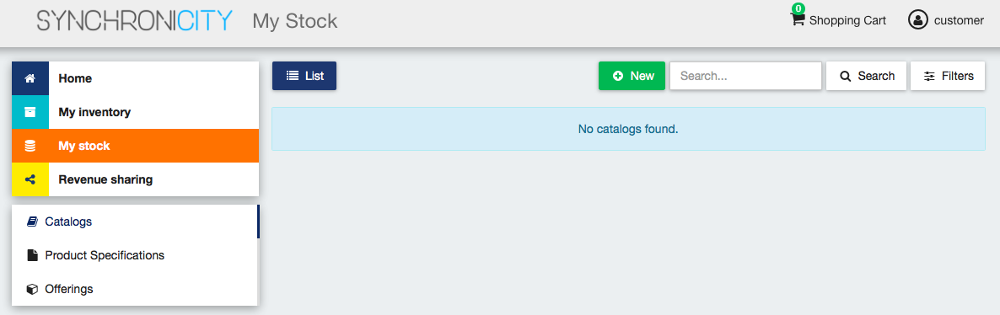
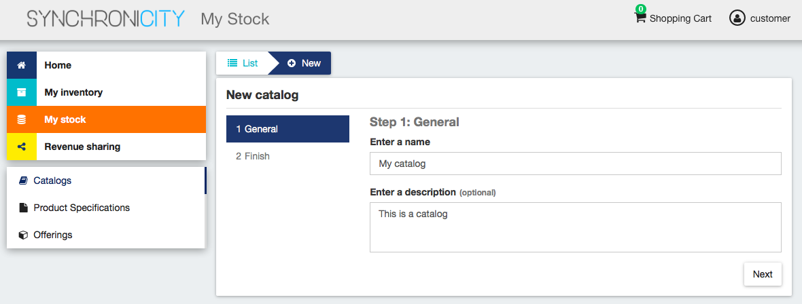
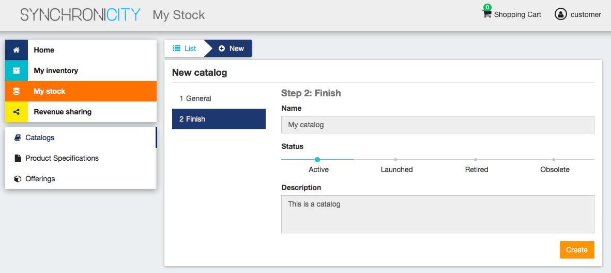
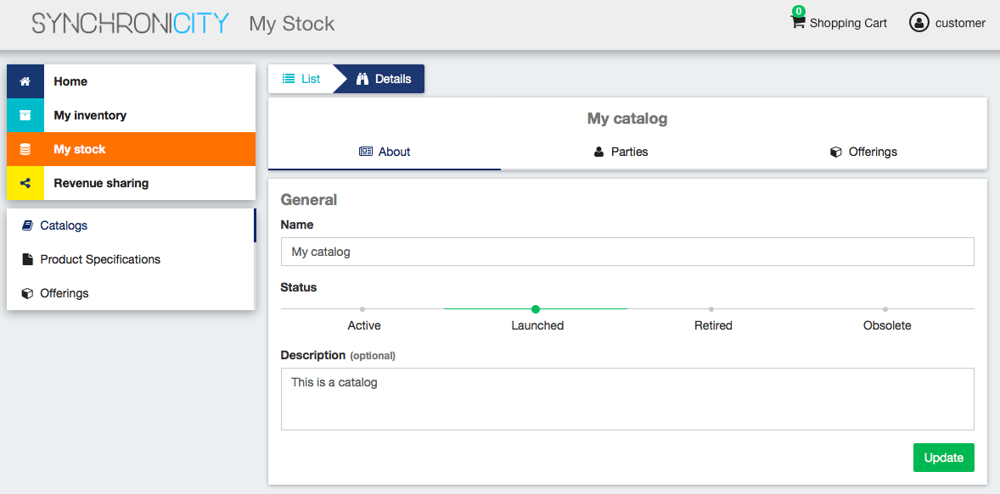
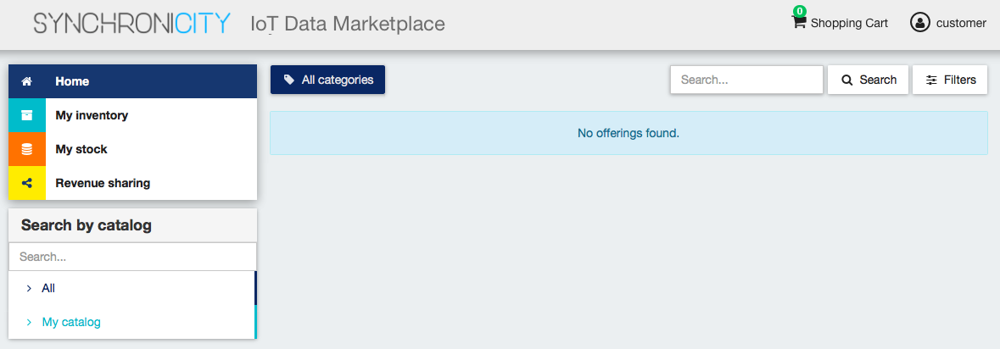

=====================================
Installation and Administration Guide
=====================================

------------
Introduction
------------

This installation and administration guide covers the SynchroniCity IoT Data Marketplace version 6.4.0 based on the `Business API Ecosystem`_ , corresponding to FIWARE release 6.
Any feedback on this document is highly welcomed, including bugs, typos or things you think should be included but aren't.
Please send them by creating an issue at `GitHub Issues`_

.. _Business API Ecosystem: https://catalogue.fiware.org/enablers/business-api-ecosystem-biz-ecosystem-ri
.. _GitHub Issues: https://github.com/caposseleDigicat/SynchroniCityDataMarketplace/issues/new

------------
Installation
------------

The SynchroniCity IoT Data Marketplace can be deployed with Docker. For all the components that made up the 
SynchroniCity IoT Data Marketplace (based on the `Business API Ecosystem`_ it has been provided a Docker image that can be used 
jointly with docker-compose in order to deploy and configure the ecosystem.


.. _Business API Ecosystem: https://github.com/FIWARE-TMForum/Business-API-Ecosystem

Requirements
============

The SynchroniCity IoT Data Marketplace is not a single software, but a set of modules that
work together for proving business capabilities. In this regard, this section contains the basic dependencies of
the different components that made up the SynchroniCity IoT Data Marketplace.

.. note::
    The SynchroniCity IoT Data Marketplace requires instances of MySQL and MongoDB running. In this regard, you have three possibilities:

    * You can have your own instances deployed in your machine
    * You can manually run docker containers before executing the SynchroniCity IoT Data Marketplace
    * You can use docker-compose to automatically deploy both components

OAuth2 Authentication requirements
----------------------------------

The SynchroniCity IoT Data Marketplace authenticates with the [FIWARE identity manager](http://fiware-idm.readthedocs.io/en/latest/). 
It is needed to register an application in this portal in order to acquire the OAuth2 credentials.

There you have to use the following info for registering the app:
* Name: The name you want for your instance
* URL: Host and port where you plan to run the instance. [http]|https://host:port/
* Callback URL: URL to be called in the OAuth process. [http]|https://host:port/auth/fiware/callback

Deploying the SynchroniCity IoT Data Marketplace
=====================================

As stated, it is possible to deploy the SynchroniCity IoT Data Marketplace using the Docker images available for each of its
modules with `docker-compose`. In particular, the following images have to be deployed:

* [bae-apis-synchronicity](https://hub.docker.com/r/angelocapossele/bae-apis-synchronicity/): Image including the TMForum APIs
* [biz-ecosystem-rss](https://hub.docker.com/r/conwetlab/biz-ecosystem-rss/): Image Including the BAE RSS module
* [charging-backend-synchronicity](https://hub.docker.com/r/angelocapossele/charging-backend-synchronicity/): Image including the charging backend module
* [logic-proxy-synchronicity](https://hub.docker.com/r/conwetlab/angelocapossele/logic-proxy-synchronicity/): Image including the logic proxy module

For deploying the SynchroniCity IoT Data Marketplace the first step is creating a `docker-compose.yml` file with the following contents (or use the one provided in this GitHub repo):

```
version: '3'
services:
    mongo:
        image: mongo:3.2
        restart: always
        ports:
            - 27017:27017
        networks:
            main:
        volumes:
            - ./mongo-data:/data/db

    mysql:
        image: mysql:latest
        restart: always
        ports:
            - 3333:3306
        volumes:
            - ./mysql-data:/var/lib/mysql
        networks:
            main:
        environment:
            - MYSQL_ROOT_PASSWORD=my-secret-pw
            - MYSQL_DATABASE=RSS

    charging:
        image: angelocapossele/charging-backend-synchronicity:v6.4.0
        restart: always
        links:
            - mongo
        depends_on:
            - mongo
            - apis
            - rss
        ports:
            - 8006:8006
        networks:
            main:
                aliases:
                    - charging.docker
        volumes:
            - ./charging-bills:/business-ecosystem-charging-backend/src/media/bills
            - ./charging-assets:/business-ecosystem-charging-backend/src/media/assets
            - ./charging-plugins:/business-ecosystem-charging-backend/src/plugins
            - ./charging-settings:/business-ecosystem-charging-backend/src/user_settings
        environment:
          - PAYPAL_CLIENT_ID=client_id_here
          - PAYPAL_CLIENT_SECRET=client_secret_here

    proxy:
        image: angelocapossele/logic-proxy-synchronicity:v6.4.0
        restart: always
        links:
            - mongo
        depends_on:
            - mongo
            - apis
        ports:
            - 8004:8004
        networks:
            main:
                aliases:
                    - proxy.docker
        volumes:
            - ./proxy-conf:/business-ecosystem-logic-proxy/etc
            - ./proxy-indexes:/business-ecosystem-logic-proxy/indexes
            - ./proxy-themes:/business-ecosystem-logic-proxy/themes
            - ./proxy-static:/business-ecosystem-logic-proxy/static
        environment:
            - NODE_ENV=development

    apis:
        image: angelocapossele/bae-apis-synchronicity:v6.4.0
        restart: always
        ports:
            - 4848:4848
            - 8080:8080
        links:
            - mysql
        depends_on:
            - mysql
        networks:
            main:
                aliases:
                    - apis.docker
        volumes:
            - ./apis-conf:/etc/default/tmf/
        environment:
            - MYSQL_ROOT_PASSWORD=my-secret-pw
            - MYSQL_HOST=mysql

    rss:
        image: conwetlab/biz-ecosystem-rss:v6.4.0
        restart: always
        ports:
            - 9999:8080
            - 4444:4848
            - 1111:8181
        links:
            - mysql
        depends_on:
            - mysql
        networks:
            main:
                aliases:
                    - rss.docker
        volumes:
            - ./rss-conf:/etc/default/rss

networks:
    main:
        external: true
```


-------------
Configuration
-------------

The next step is providing all the configuration files required by the different components using the configured volumes.
It is possible to find valid configuration files (as well as the `docker-compose.yml`) in this GitHub repo (https://github.com/caposseleDigicat/SynchroniCityDataMarketplace)

As you can see, the different modules include environment variables and volumes. In particular:

Charging
========

The charging-backend-synchronicity needs the following environment variables:
* **PAYPAL_CLIENT_ID**: the client id of your application PayPal credentials used for charging users (a Sandbox account can be used for testing).
* **PAYPAL_CLIENT_SECRET**: the client secret of your application PayPal credentials used for charging users (a Sandbox account can be used for testing).

Additionally, the charging-backend-synchronicity image contains 4 volumes. In particular:
* */business-ecosystem-charging-backend/src/media/bills*: This directory contains the PDF invoices generated by the Business Ecosystem Charging Backend
* */business-ecosystem-charging-backend/src/media/assets*: This directory contains the different digital assets uploaded by sellers to the Business Ecosystem Charging Backend
* */business-ecosystem-charging-backend/src/plugins*: This directory is used for providing asset plugins (see section *Installing Asset Plugins*)
* */business-ecosystem-charging-backend/src/user_settings*: This directory must include the *settings.py* and *services_settings.py* files with the software configuration. More specifically, the *services_settings.py* includes:
    * KEYSTONE_PROTOCOL: http or https
    * KEYSTONE_HOST: host where is running the IDM (e.g., 'idm.docker')
    * KEYROCK_PORT: port number where the *Keyrock* instance is listening (e.g., '8000')
    * KEYSTONE_PORT: port number where the *Keystone* instance  is listening (e.g., '5000')
    * KEYSTONE_USER: admin username of the IDM (e.g., 'idm')
    * KEYSTONE_PWD: admin password of the IDM (e.g., 'idm')
    * ADMIN_DOMAIN: admin domain on the IDM (e.g., 'Default') 
    * APP_CLIENT_ID: Client ID of the Orion context broker registered on the IDM
    * APP_CLIENT_SECRET: Client Secret of the Orion Context Broker registered on the IDM


Logic Proxy
===========

The logic-proxy-synchronicity image contains 4 volumes. In particular:
* */business-ecosystem-logic-proxy/etc*: This directory must include the `config.js` file with the software configuration
* */business-ecosystem-logic-proxy/indexes*: This directory contains the indexes used by the SynchroniCity IoT Data Marketplace for searching
* */business-ecosystem-logic-proxy/themes*: This directory contains the themes that can be used to customize the web portal
* */business-ecosystem-logic-proxy/static*: This directory includes the static files ready to be rendered including the selected theme and js files

Finally, the logic-proxy-synchronicity uses the environment variable *NODE_ENV* to determine if the software is being used
in *development* or in *production* mode. 

> **Note**
> The *config.js* file must include an extra setting not provided by default called *config.extPort* that must include the port where the proxy is going to run in the host machine

Once you have created the files, run the following command:

    $ docker-compose up

Then, the SynchroniCity IoT Data Marketplace should be up and running in `http://YOUR_HOST:PORT/` replacing `YOUR_HOST` by the host of your machine and `PORT` by the port provided in the Business Ecosystem Logic Proxy configuration 

Once the different containers are running, you can stop them using:

    $ docker-compose stop

And start them again using:

    $ docker-compose start

Additionally, you can terminate the different containers by executing:

    $ docker-compose down


## Installing Orion Query Plugin

As you may know, the SynchroniCity IoT Data Marketplace is able to sell different types of data sources. To support this functionality, it must be installed the Orion Query plugin (also included in the current Github repo) as follows:

1) Copy the plugin file into the host directory of the volume */business-ecosystem-charging-backend/src/plugins*

2) Enter the running container:

    $ docker exec -i -t your-container /bin/bash


3) Go to the installation directory

    $ cd /apis/business-ecosystem-charging-backend/src


4) Load the plugin

    $ ./manage.py loadplugin ./plugins/Orion.zip


5) Restart Apache

    $ service apache2 restart


------------------------
Installing Asset Plugins
------------------------

The Business API Ecosystem is intended to support the monetization of different kind of digital assets. The different
kind of assets that may be wanted to be monetized will be heterogeneous and potentially very different between them.

Additionally, for each type of asset different validations and activation mechanisms will be required. For example, if the
asset is a CKAN dataset, it will be required to validate that the provider is the owner of the dataset. Moreover, when a customer
acquires the dataset, it will be required to notify CKAN that a new user has access to it.

The huge differences between the different types of assets that can be monetized in the Business API Ecosystem makes
impossible to include its validations and characteristics as part of the core software. For this reason, it has been created
a plugin based solution, where all the characteristics of an asset type are implemented in a plugin that can be loaded
in the Business API Ecosystem.

To include an asset plugin execute the following command in the Charging Backend: ::

    $ ./manage.py loadplugin ckandataset.zip

It is possible to list the existing plugins with the following command: ::

    $ ./manage.py listplugins

To remove an asset plugin, execute the following command providing the plugin id given by the *listplugins* command ::

    $ ./manage.py removeplugin ckan-dataset


.. note::
    For specific details on how to create a plugin and its internal structure, have a look at the Business API Ecosystem Programmer Guide

At the time of writing, the following plugins are available:

* `Basic File <https://github.com/FIWARE-TMForum/biz-basic-plugins>`__: Allows the creation of products by providing files as digital assets. No validations or processing is done
* `Basic URL <https://github.com/FIWARE-TMForum/biz-basic-plugins>`__: Allows the creation of products by providing URLs as digital assets. No validations or processing is done
* `WireCloud Component <https://github.com/FIWARE-TMForum/wstore-wirecloud-plugin>`__: Allows the monetization of WireCloud components, including Widgets, operators, and mashups
* `Accountable Service <https://github.com/FIWARE-TMForum/biz-accountable-service-plugin>`__ : Allows the monetization of services protected by the `Accounting Proxy <https://github.com/FIWARE-TMForum/Accounting-Proxy>`__, including Orion Context Broker queries
* `CKAN Dataset <https://github.com/FIWARE-TMForum/biz-ckan-plugin>`__ : Allows the monetization of CKAN datasets


-----------------------
Sanity check Procedures
-----------------------

The Sanity Check Procedures are the steps that a System Administrator will take to verify that an installation is ready
to be tested. This is therefore a preliminary set of tests to ensure that obvious or basic malfunctioning is fixed before
proceeding to unit tests, integration tests and user validation.

End to End Testing
==================

Please note that the following information is required before starting with the process:
* The host and port where the Proxy is running
* A valid IdM user with the *Seller* role

To Check if the Business API Ecosystem is running, follow the next steps:

1. Open a browser and enter to the Business API Ecosystem
2. Click on the *Sign In* Button



3. Provide your credentials in the IdM page



4. Go to the *Revenue Sharing* section



5. Ensure that the default RS Model has been created



6. Go to *My Stock* section

.. image:: ./images/installation/sanity5.png

7. Click on *New* for creating a new catalog



8. Provide a name and a description and click on *Next*. Then click on *Create*





9. Click on *Launched*, and then click on *Update*

.. image:: ./images/installation/sanity10.png


10. Go to *Home*, and ensure the new catalog appears

.. image:: ./images/installation/sanity12.png


List of Running Processes
=========================

We need to check that Java for the Glassfish server (APIs and RSS), python (Charging Backend) and Node (Proxy) are running,
as well as MongoDB and MySQL databases. If we execute the following command: ::

    ps -ewF | grep 'java\|mongodb\|mysql\|python\|node' | grep -v grep

It should show something similar to the following: ::

    mongodb   1014     1  0 3458593 49996 0 sep08 ?        00:22:30 /usr/bin/mongod --config /etc/mongodb.conf
    mysql     1055     1  0 598728 64884  2 sep08 ?        00:02:21 /usr/sbin/mysqld
    francis+ 15932 27745  0 65187 39668   0 14:53 pts/24   00:00:08 python ./manage.py runserver 0.0.0.0:8006
    francis+ 15939 15932  1 83472 38968   0 14:53 pts/24   00:00:21 /home/user/business-ecosystem-charging-backend/src/virtenv/bin/python ./manage.py runserver 0.0.0.0:8006
    francis+ 16036 15949  0 330473 163556 0 14:54 pts/25   00:00:08 node server.js
    root      1572     1  0 1142607 1314076 3 sep08 ?      00:37:40 /usr/lib/jvm/java-8-oracle/bin/java -cp /opt/biz-ecosystem/glassfish ...

Network interfaces Up & Open
============================

To check the ports in use and listening, execute the command: ::

    $ sudo netstat -nltp

The expected results must be something similar to the following: ::

    Active Internet connections (only servers)
    Proto Recv-Q Send-Q Local Address           Foreign Address         State       PID/Program name
    tcp        0      0 127.0.0.1:8006          0.0.0.0:*               LISTEN      15939/python
    tcp        0      0 127.0.0.1:27017         0.0.0.0:*               LISTEN      1014/mongod
    tcp        0      0 127.0.0.1:28017         0.0.0.0:*               LISTEN      1014/mongod
    tcp        0      0 127.0.0.1:3306          0.0.0.0:*               LISTEN      1055/mysqld
    tcp6       0      0 :::80                   :::*                    LISTEN      16036/node
    tcp6       0      0 :::8686                 :::*                    LISTEN      1572/java
    tcp6       0      0 :::4848                 :::*                    LISTEN      1572/java
    tcp6       0      0 :::8080                 :::*                    LISTEN      1572/java
    tcp6       0      0 :::8181                 :::*                    LISTEN      1572/java

Databases
=========

The last step in the sanity check, once we have identified the processes and ports, is to check that MySQL and MongoDB
databases are up and accepting queries. We can check that MySQL is working, with the following command: ::

    $ mysql -u <user> -p<password>

You should see something similar to: ::

    Welcome to the MySQL monitor.  Commands end with ; or \g.
    Your MySQL connection id is 174
    Server version: 5.5.47-0ubuntu0.14.04.1 (Ubuntu)

    Copyright (c) 2000, 2015, Oracle and/or its affiliates. All rights reserved.

    Oracle is a registered trademark of Oracle Corporation and/or its
    affiliates. Other names may be trademarks of their respective
    owners.

    Type 'help;' or '\h' for help. Type '\c' to clear the current input statement.

    mysql>

For MongoDB, execute the following command: ::

    $ mongo <database> -u <user> -p <password>

You should see something similar to: ::

    MongoDB shell version: 2.4.9
    connecting to: <database>
    >

--------------------
Diagnosis Procedures
--------------------

The Diagnosis Procedures are the first steps that a System Administrator will take to locate the source of an error in a GE.
Once the nature of the error is identified with these tests, the system admin will very often have to resort to more concrete
and specific testing to pinpoint the exact point of error and a possible solution. Such specific testing is out of the scope
of this section.

Resource Availability
=====================

Memory use depends on the number of concurrent users as well as the free memory available and the hard disk.
The Business API Ecosystem requires a minimum of 1024 MB of available RAM memory, but 2048 MB of free memory are recomended.
Moreover, the Business API Ecosystem requires at least 15 GB of hard disk space.

Remote Service Access
=====================

N/A

Resource Consumption
====================

Resource consumption strongly depends on the load, especially on the number of concurrent users logged in.

* Glassfish main memory consumption should be between 500 MB and 2048 MB
* MongoDB main memory consumption should be between 30 MB and 500 MB
* Pyhton main memory consumption should be between 30 MB and 200 MB
* Node main memory consumption should be between 30 MB and 200 MB
* MySQL main memory consumption should be between 30 MB and 500 MB

I/O Flows
=========

The only expected I/O flow is of type HTTP, on port defined in the Logic Proxy configuration file
