==========
User Guide
==========

Introduction
============

This user guide covers the `SynchroniCity IoT Data Marketplace <https://github.com/caposseleDigicat/SynchroniCityDataMarketplace>`__ based on the `Business API Ecosystem <https://catalogue.fiware.org/enablers/business-api-ecosystem-biz-ecosystem-ri>`__ version 6.4.0, corresponding to FIWARE release 6.
Any feedback on this document is highly welcomed, including bugs, typos or things you think should be included but aren't.
Please send them by creating an issue at `GitHub Issues`_

.. _GitHub Issues: https://github.com/caposseleDigicat/SynchroniCityDataMarketplace/issues/new

This user guide contains a description of the different tasks that can be performed in the SynchroniCity IoT Data Marketplace using
its web interface. This section is organized so that actions related to a particular user role are grouped together.

Profile Configuration
=====================

All the users of the system can configure their profile, so they can configure their personal information as well as their
billing addresses and contact mediums.

To configure the user profile, the first step is opening the user *Settings* located in the user menu.

In the displayed view, it can be seen that some information related to the account is already included (*Username*, *Email*, *Access token*).
This information is the one provided by the IdM after the login process.

The profile to be updated depends on whether the user is acting on behalf an organization or himself. In both cases, to
update the profile, fill in the required information and click on *Update*.

For users, personal information is provided.

.. note::
   Only the *First name* and *Last name* fields are mandatory

Once you have created your profile, you can include contact mediums by going to the *Contact mediums* section.
In the *Contact Medium* section, there are two different tabs. On the one hand, the *Billing addresses* tab, where you
can register the billing addresses you will be able to use when creating orders and purchasing data.

To create a blling address, fill in the fields and click on *Create*

Once created, you can edit the address by clicking on the *Edit* button of the specific address, and changing the
wanted fields.

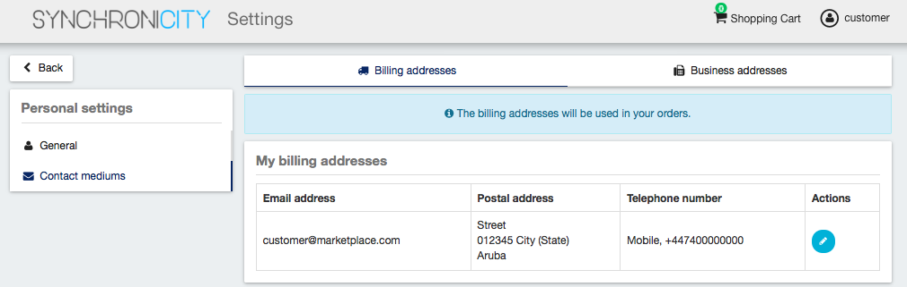

On the other hand, if you have the *Seller* role you can create *Business Addresses*, which can be used by your customers
in order to allow them to contact you. In the *Business Addresses* tab you can create, different kind of contact mediums, including emails, phones, and addresses.
To create a contact medium, fill in the fields and click on *Create*

.. image:: ./images/user/profile9.png
   :align: center

You can *Edit* or *Remove* the contact medium by clicking on the corresponding button

Admin
=====

If the user of the SynchroniCity IoT Data Marketplace is an admin, he will be able to access the *Administration* section of the
web portal. This section is located in the user menu.

Manage Categories
-----------------

Admin users are authorized to create the system categories that can be used by *Sellers* to categorize their catalogs,
data sources, and offerings.

To create categories, go to the *Administration* section, and click on *New*

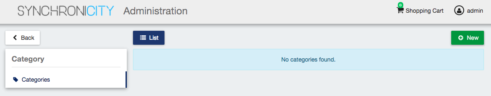

Then, provide a name and an optional description for the category. Once the information has been included, click on *Next*, and then on *Create*

Categories in the SynchroniCity IoT Data Marketplace can be nested, so you can choose a parent category if you want while creating.

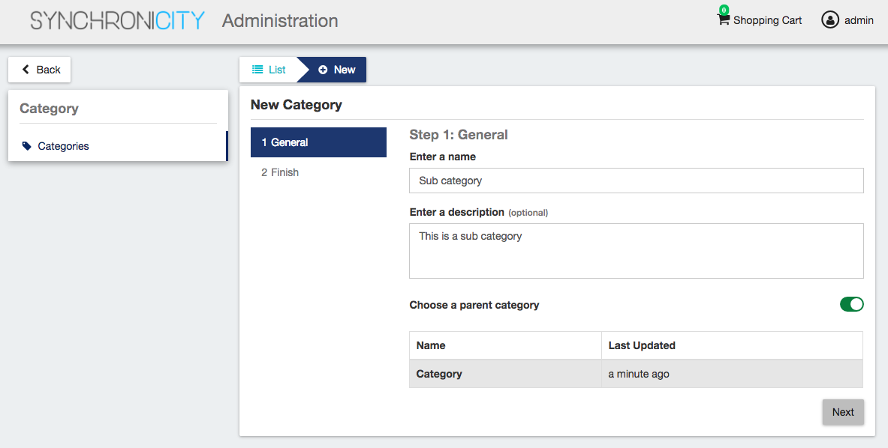

Existing categories can be updated. To edit a category click on the category name.

Then edit the corresponding fields and click on *Update*.

Seller
======

If the user of the SynchroniCity IoT Data Marketplace has the *Seller* role, he will be able to share and monetize his data sources by creating
catalogs, data source specifications and offerings. All these objects are managed accessing *My Stock* section.

Manage Catalogs
---------------

The *Catalogs* section is the one that is open by default when the seller accesses *My Stock* section. This section
contains the catalogs the seller has created. Additionally, it has been defined several mechanisms for searching and filtering the list of catalogs displayed. On the one
hand, it is possible to search catalogs by keyword using the search input provided in the menu bar. On the other hand,
it is possible to specify how catalog list should be sorted or filter the shown catalogs by status and the role you are
playing. To do that, click on *Filters*, choose the required parameters, and click on *Close*.

To create a new catalog click on the *New* button. Then, provide a name and an optional description for the catalog. 
Once you have filled the fields, click on *Next*, and then on *Create*

Sellers can also update their catalogs. To do that, click on the name of the catalog to open the update view.

Then, update the fields you want to modify and click on *Update*. In this view, it is possible to change the *Status* of the
catalog. To start monetizing the catalog, and make it appear in the *Home* you have to change its status to *Launched*

Manage Data Source Specifications
-----------------------------

Data Source Specifications represent the data source being offered. To list your data source specifications
go to *My Stock* section and click on *Data source specifications*.

In the same way as catalogs, data source specifications can be searched by keyword, sorted, or filtered by status and whether
they are bundles or not. To filter or sort data source specifications, click on *Filters*, choose the appropriate properties, and click on *Close*

Additionally, it is possible to switch between the grid view and the tabular view using the provided buttons.

To create a new data source specification click on *New*. In the displayed view, provide the general information of the data source spec. including its name, version, and an optional
description. In addition, you have to include the data source brand (Your brand), and an ID number which identifies the data source
in your environment. Then, click on *Next*.

In the next step you you will be required to provide the asset.

For providing the asset, you have to choose between the available asset types, choose how to provide the asset between the
available options, provide the asset, and include all the required information.

.. note::
    *Application ID* has to be the same application ID of the *Orion Context Broker* instance registered on the IdM where your data source belongs.
    *Fiware-Service* is the header used to register your data source as an entity on the *Orion Context Broker*. If your user does not have a provider 
    role for that specific *Fiware-Service* (e.g., *TenantRZ1:provider*) you will not be allowed to publish data source specification for that entity.

The next step in the creation of a data source spec. is including its characteristics. For including a new characteristic click on
*New Characteristic*

In the form, include the name, the type (string or number) and an optional description. Then create the values of the
characteristic by filling the *Create a value* input and clicking on *+*.

Once you have included all the characteristic info, save it clicking on *Create*

Once you have included all the required characteristics click on *Next*

In the next step you can include a picture for your data source spec. You have two options, providing an URL pointing to the
picture or directly uploading it. Once provided click *Next* 
(Image credit for this example: `oNline Web Fonts <http://www.onlinewebfonts.com>`__ )

Once done click on *Next* and then on *Create*

Sellers can update their data source. To do that click on the data source specification to be updated.

Update the required values and click on *Update*. Note that for start selling an offering that includes the data source specification
you will be required to change its status to *Launched*

.. image:: ./images/user/product22.png
   :align: center
   :scale: 50%

Manage Data Offerings
------------------------

Data Offerings are the entities that contain the pricing models and revenue sharing info used to monetize a data source specification.
To list your data offerings, go to *My Stock* section and click on *Offerings*

.. image:: ./images/user/offering1.png
   :align: center
   :scale: 50%

The existing data source offerings can be searched by keyword, sorted, or filtered by status and whether they are bundles or not.
To filter or sort data offerings, click on *Filters*, choose the appropriate properties, and click on *Close*

Additionally, it is possible to switch between the grid view and the tabular view by clicking on the specific button.

.. image:: ./images/user/offering4.png
   :align: center
   :scale: 50%

To create a new offering click on *New*

.. image:: ./images/user/offering6.png
   :align: center
   :scale: 50%

In the displayed form, include the basic info of the offering. Including, its name, version, an optional description, and
an optional set of places where the offering is available. Once the information has been provided click on *Next*

In the next step, you can choose whether your offering is a bundle or not. In this case, offering bundles are logical
containers that allow you to provide new pricing models when a set of offerings are acquired together. Once selected click
on *Next*

.. image:: ./images/user/offering8.png
   :align: center

If you want to create a bundle you will be required to include at least two bundled offerings.

In the next step you have to select the data source specification that is going to be monetized in the current offering. Once
selected click on *Next*.

.. note::
   If you are creating an offering bundle, you will not be allowed to include a data source specification

Then, you have to select the catalog where you want to publish you offering and click on *Next*

In the next step, you can optionally choose categories for you offering. Once done, click on *Next*

.. image:: ./images/user/offering12.png
   :align: center

In the next step, you can specify the terms and conditions that apply to your offering and that must be accepted by those
customers who want to acquire it. To do that, include a title and a text for your terms and click on *Next*. Note that
the terms and conditions are not mandatory.

.. image:: ./images/user/product19.png
   :align: center

The next step is the more important for the offering. In the displayed form you can create different price plans for
you offering, which will be selectable by customers when acquiring the offering. If you do not include any price plan
the offering in considered free.

To include a new price plan the first step is clicking on *New Price Plan*

.. image:: ./images/user/offering13.png
   :align: center

For creating the price plan, you have to provide a name, and an optional description. Then, you have to choose the type
of price plan between the provided options.

The available types are: *one time* for payments that are made once when purchasing the offering, *recurring* for charges
that are made periodically (e.g a monthly payment), and *usage* for charges that are calculated applying the pricing model
to the actual usage made of the acquired service.

If you choose *one time*, you have to provide the price and the currency.

If you choose *recurring*, you have to provide the price, the currency, and the period between charges.

.. image:: ./images/user/offering15.png
   :align: center

If you choose usage, you have to provide the unit to be accounted, the currency, and the price per unit

.. image:: ./images/user/offering16.png
   :align: center

You can update or remove plans by clicking on the corresponding action button.

Once you have created you pricing model click on *Next*

.. image:: ./images/user/offering18.png
   :align: center

In the last step of the process, you have to choose the revenue sharing model to be applied to you offering between the
available ones. Once done, click on *Next* and then on *Create*.

Sellers can also edit their offerings. To do that click on the offering to be updated.

.. image:: ./images/user/offering21.png
   :align: center
   :scale: 50%

In the displayed form, change the fields you want to edit and click on *Update*. Note that for start selling you offering
you have to update its status to *Launched*

It is also possible to update the *Price Plans* and *Categories* of the offering by accessing to the related tab.

.. image:: ./images/user/offering23.png
   :align: center
   :scale: 50%

Manage Revenue Sharing Models
-----------------------------

Revenue Sharing Models specify how the revenues generated by an offering or set of offerings must be distributed between
the owner of the Business API Ecosystem instance, the provider of the offering, and the related stakeholders involved.

To manage RS models go to the *Revenue Sharing* section.

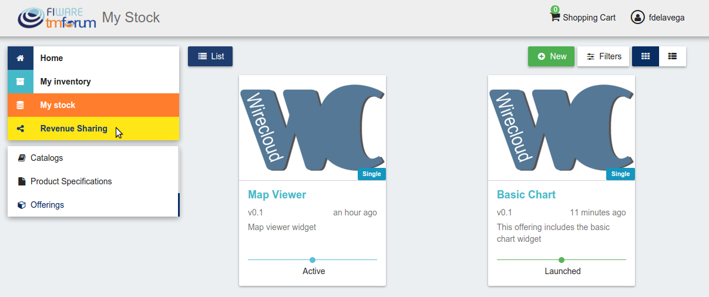

In this view, you can see the revenue sharing models you have available. By default it will appear the default RS model
which establishes the revenue distribution between you and the Business API Ecosystem instance owner.

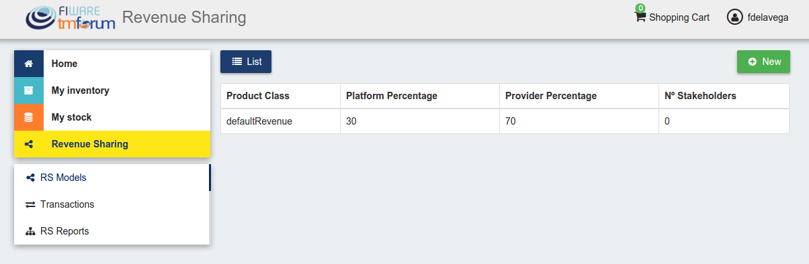

You can create a new RS model clicking on *New*

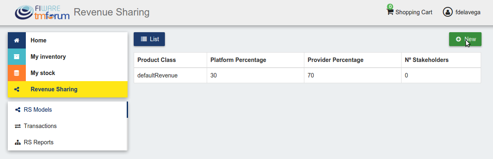

In the first step of the process you have to provide a product class, which identifies the RS model, and the percentage
you want to receive. The platform percentage is fixed and cannot be modified. Once provided click on *Next*

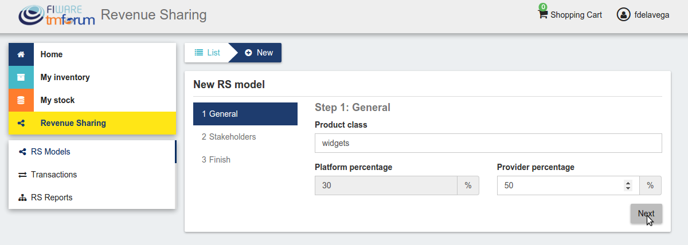

In the next step, you can optionally add more stakeholders to the RS model. To do that click on *New Stakeholder*

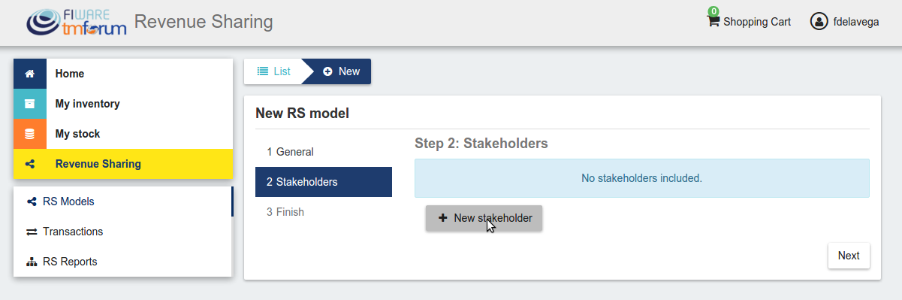

Then, select the Stakeholder between the available users, and provide its percentage. Finally, save it clicking on *Create*

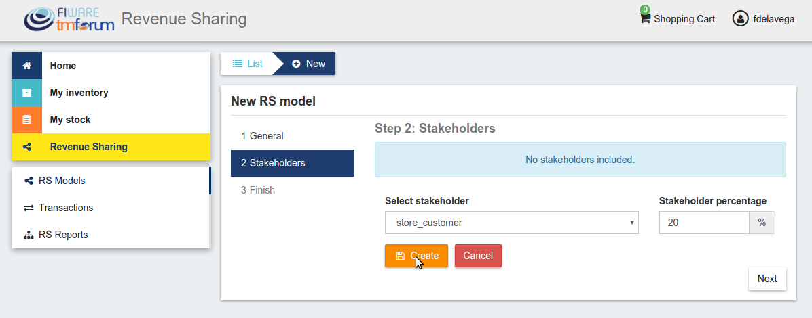

.. note::
   The total percentage (provider + platform + stakeholders) must be equal to 100

Finally, click on *Next* and then on *Create*

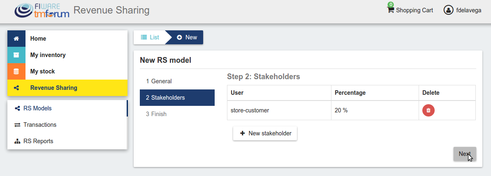

.. image:: ./images/user/revenue8.png
   :align: center

Sellers can also update their RS model. To do that click on the RS model to be updated.

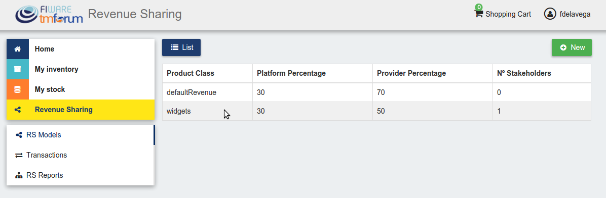

Then, update the required fields (including the stakeholders if you want), and click on *Save Changes*

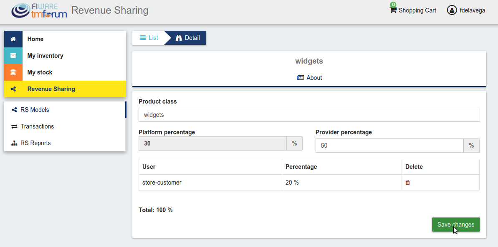

Manage Transactions
-------------------

Sellers can manage the transactions related to their products in order to know how much money their products are generating,
and to launch the revenue sharing process. To manage your seller transactions go to *Revenue Sharing* and click on *Transactions*

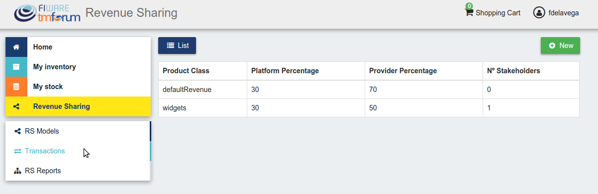

In the displayed view, you can see the transactions pending to be paid to you and your stakeholders. It is also possible
to display the transactions in tabular way

.. image:: ./images/user/tran2.png
   :align: center

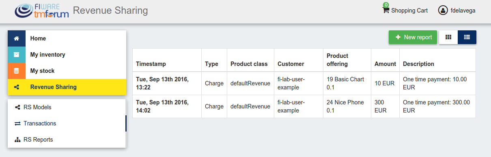

These transactions are aggregated and paid by the Business API Ecosystem periodically once a month. Nevertheless, if you
need to be paid, you can force the revenue sharing calculus and payment of your pending transactions by manually generating
a revenue sharing report.

To create a new report click on *New Report*

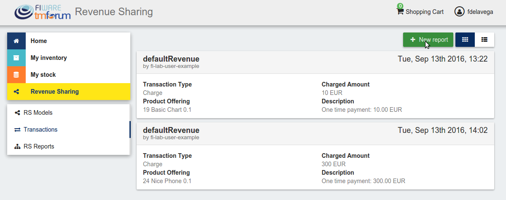

In the displayed modal, choose the product classes to be calculated and click on *Create*

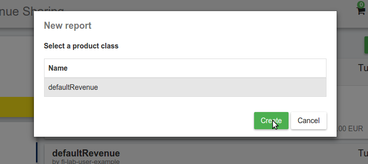

This process will aggregate all the transactions with the selected product classes, calculate the amount to be paid to
each stakeholder using the related revenue sharing model, generate a revenue sharing report,
and pay the seller and the stakeholders using their PayPal account.

You can see the generated reports clicking on *RS Reports*

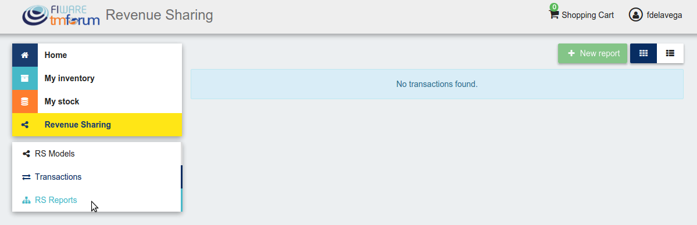

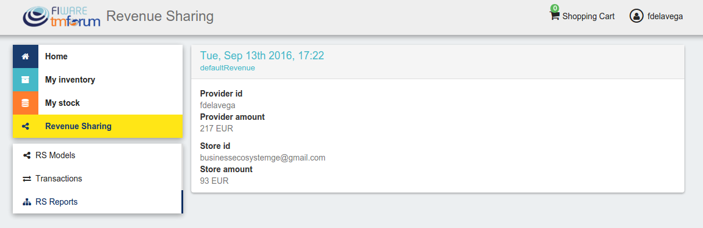

.. note::
   Sellers would need to have a PayPal account associated to the email of their FIWARE IdM account in order to be paid for
   their products

Customer
========

All of the users of the system have by default the *Customer* role. Customers are able to create orders for acquiring
offerings.

List Available Offerings
------------------------

All the available (*Launched*) offerings appear in the *Home* page of the SynchroniCity IoT Data Marketplace, so they can be seen by
customers.

.. image:: ./images/user/search1.png
   :align: center
   :scale: 50%

Additionally, customers can select a specific catalog of offerings by clicking on it.

.. image:: ./images/user/search2.png
   :align: center
   :scale: 50%

Moreover, customers can filter the shown offerings by category using the categories dropdown and choosing the wanted one.

Customers can also filter bundle or single offerings using the *Filters* modal as well as choosing its sorting.

.. image:: ./images/user/search5.png
   :align: center
   :scale: 50%

Finally, customers can search offerings by keyword using the provided search bar

.. image:: ./images/user/search6b.png
   :align: center
   :scale: 50%

Customers can open the details of an offering by clicking on it

.. image:: ./images/user/search7.png
   :align: center
   :scale: 50%

In the displayed view, it is shown the general info about the offering and its included data source, the characteristics of
the data source, and the price plans of the offering.

.. image:: ./images/user/search9.png
   :align: center
   :scale: 50%

.. image:: ./images/user/search10.png
   :align: center
   :scale: 50%

Create Order
------------

Customers can create orders for acquiring offerings. The different offerings to be included in an order are managed using
the *Shopping Cart*.

To include an offering in the shopping cart there are two possibilities. You can click on the *Add to Cart* button located
in the offering panel when searching, or you can click on the *Add to Cart* button located in the offering details view.

.. image:: ./images/user/order2.png
   :align: center
   :scale: 50%

If the offering has configurable characteristics, multiple price plans or terms and conditions, a modal will be displayed where you can select
your preferred options

.. image:: ./images/user/order4b.png
   :align: center
   :scale: 50%

Once you have selected your preferences for the offering click on *Add to Cart*

.. image:: ./images/user/order5.png
   :align: center
   :scale: 50%

Once you have included all the offerings you want to acquire to the shopping cart, you can create the order clicking on
*Shopping Cart*, and then on *Checkout*

.. image:: ./images/user/order6.png
   :align: center
   :scale: 50%

Then, you have to select one of your billing addresses.

Once you have provided all the required information you can start the order creation clicking on *Checkout*

If the offering has a price plan, you will be redirected to *PayPal* so you can pay for the offerings according to their pricing models

.. image:: ./images/user/order8.png
   :align: center

Finally, you will see a confirmation page

.. image:: ./images/user/order9.png
   :align: center

Manage Acquired Products
------------------------

The data you have acquired are located in *My Inventory*, there you can list them, check their status, or retrieve the access token required to access them.

.. image:: ./images/user/inv1.png
   :align: center

In this view, it is possible to filter you data by its status. To do that click on *Filters*, select the related statuses,
and click on *Close*

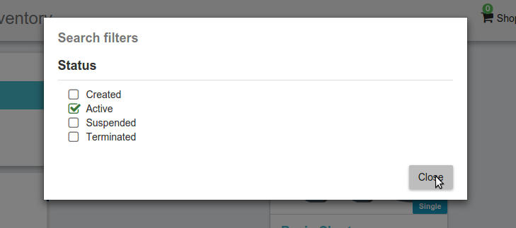

It is also possible to switch between the grid and tabular views using the related buttons

.. image:: ./images/user/inv4.png
   :align: center

You can manage a specific acquired data source clicking on it

.. image:: ./images/user/inv6.png
   :align: center

In the displayed view, you can see the general info of the acquired data source, and the characteristics and pricing you have selected.

Additionally, you can see your charges related to the data source accessing to the *Charges* tab

In this tab, you will find detailed information of the different charges and you will be able to download the related invoice
clicking on *Download Invoice*

.. image:: ./images/user/inv11.png
   :align: center

Moreover, this data source view allows to retrieve the related access token. To do that click on *Access*

.. image:: ./images/user/inv12.png
   :align: center

To generate a new access token insert your IdM password and press the *Generate* button.

.. image:: ./images/user/token.png
   :align: center

In case the chosen pricing model defines a recurring payment or a usage payment, you will be able to renew your data source
clicking on *Renew*. After clicking, you will be redirected to PayPal to pay the related amount.

.. image:: ./images/user/inv13.png
   :align: center

.. note::
   If your data source has expired and you do not renew it, it will be suspended, which means you will not have access to the
   acquired service until you pay

If the acquired data source has a usage based price plan, you will be able to see your current consumption accessing the *Usage* tab

.. image:: ./images/user/inv14.png
   :align: center

